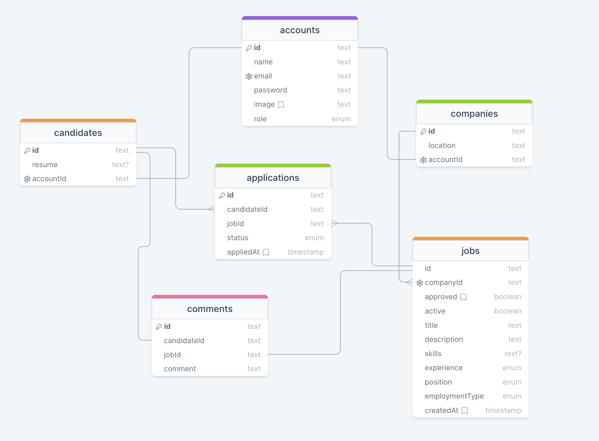

# ITJob

User-friendly platform connecting IT professionals of all levels with companies
looking to hire. The platform simplifies job applications for candidates and the
hiring process for companies.

## Demo

Visit [ITJob demo](http://itjob.bojangabric.com/) to check out it's
functionalities.

Candidate login info:

- email: `candidate@test.com`
- password: `candidate123`

Company login info:

- email: `company@test.com`
- password: `company123`

## Run Locally

Clone the project

```bash
  git clone https://github.com/bojangabric/it-jobs
```

Go to the project directory

```bash
  cd it-jobs
```

Install dependencies

```bash
  npm install
```

### Environment Variables

To run this project, you will need to add the following environment variables to
your `.env` file:

```
CLOUDINARY_CLOUD_NAME
CLOUDINARY_API_KEY
CLOUDINARY_API_SECRET
```

### Starting the app

Start docker

```bash
  docker-compose up
```

And run the project

```bash
  npm run dev
```

Go to `http://localhost:3000` and you should see the project up and running!

## Role functionalities

Everyone:

- Register & login
- Search & filter through job posts

Company:

- Add & remove job post
- Activate & deactivate job post
- See candidate details
- Accept & reject candidates

Candidate:

- Apply & cancel application for a job post
- Comment on a job post
- Add & update CV
- Add job post to favorites

Moderator:

- Approve newly made job posts

## Technologies used

- Next.js
- tRPC
- Tailwind CSS
- TypeScript
- Prisma
- PostgreSQL
- NextAuth.js
- Docker

## Database schema


